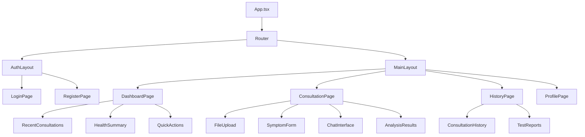
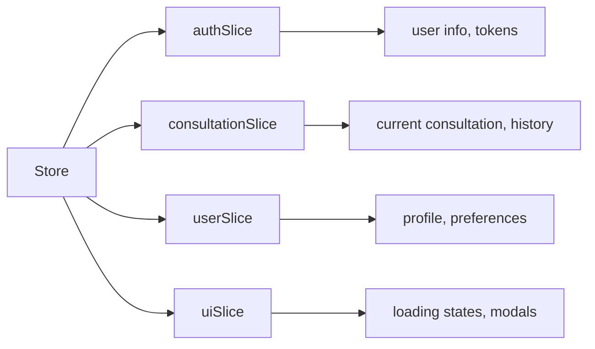
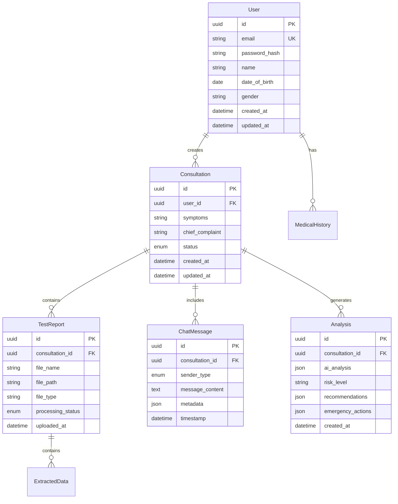
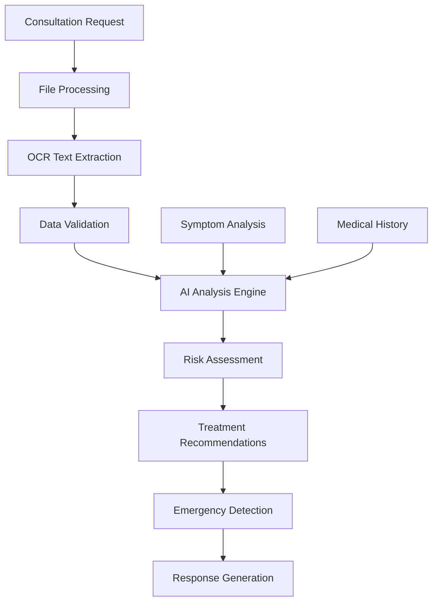
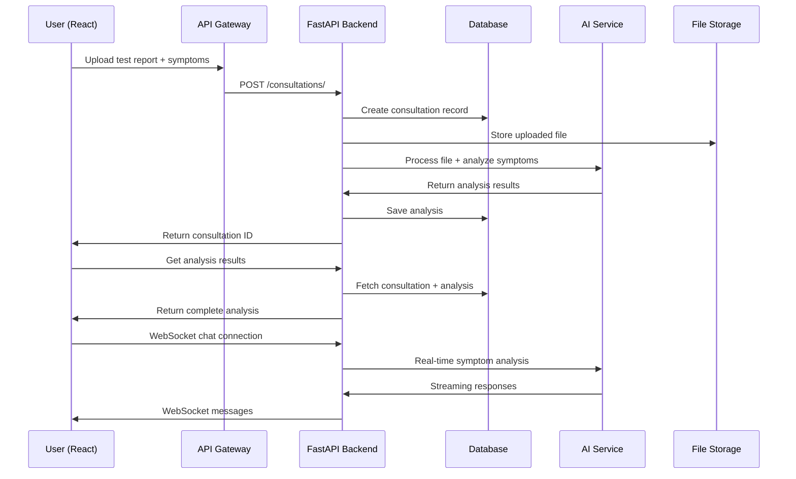

# AI Doctor Assistant - System Design Document

## Overview

The AI Doctor Assistant is a full-stack web application that provides medical analysis and emergency treatment recommendations based on uploaded test reports and patient symptoms. The system leverages artificial intelligence to analyze medical data and provide preliminary medical insights while emphasizing that it cannot replace professional medical consultation.

### Core Features
- Medical test report upload and processing (PDF, images)
- Symptom description and analysis
- AI-powered medical assessment
- Emergency treatment recommendations
- Medical history tracking
- User authentication and data privacy
- Real-time chat interface with AI assistant

### Technology Stack
- **Backend**: FastAPI (Python)
- **Frontend**: React (TypeScript)
- **Database**: PostgreSQL
- **File Storage**: AWS S3 / Local storage
- **AI/ML**: OpenAI GPT-4 / Custom medical models
- **Authentication**: JWT tokens
- **Document Processing**: PyPDF2, Tesseract OCR
- **Deployment**: Docker containers

## Frontend Architecture

### Component Hierarchy



### Component Definition

#### Core Components

**1. FileUpload Component**
- Drag-and-drop interface for test reports
- Support for PDF, JPG, PNG formats
- File validation and preview
- Progress tracking for uploads
- File size and type restrictions

**2. SymptomForm Component**
- Multi-step form for symptom collection
- Body diagram for symptom location
- Severity scale (1-10)
- Duration tracking
- Associated symptoms checklist

**3. ChatInterface Component**
- Real-time messaging with AI assistant
- Message history display
- Typing indicators
- File attachment support
- Emergency alert system

**4. AnalysisResults Component**
- AI analysis summary
- Risk level indicators
- Emergency treatment recommendations
- Follow-up suggestions
- Disclaimer notices

### State Management

Using Redux Toolkit for global state management:



**State Structure:**
- `auth`: User authentication status, JWT tokens
- `consultation`: Current consultation data, analysis results
- `user`: User profile, medical history
- `ui`: Loading states, modal visibility, notifications

### API Integration Layer

**API Service Structure:**
- `authAPI`: Login, register, refresh tokens
- `consultationAPI`: Create consultation, upload files, get analysis
- `userAPI`: Profile management, medical history
- `chatAPI`: Real-time messaging with AI

### Routing & Navigation

```mermaid
graph TD
    A[/ - Landing] --> B[/auth - Authentication]
    A --> C[/dashboard - Protected Routes]
    
    B --> D[/auth/login]
    B --> E[/auth/register]
    
    C --> F[/dashboard/home]
    C --> G[/dashboard/consultation]
    C --> H[/dashboard/history]
    C --> I[/dashboard/profile]
    
    G --> J[/consultation/:id]
```

**Route Protection:**
- Public routes: Landing, Login, Register
- Protected routes: Dashboard, Consultation, History, Profile
- Role-based access control for admin features

### Styling Strategy

Using Tailwind CSS with custom component library:

- Design system with medical theme colors
- Responsive design for mobile and desktop
- Accessibility compliance (WCAG 2.1)
- Custom components for medical UI elements
- Dark/light theme support

## Backend Architecture

### API Endpoints Reference

#### Authentication Endpoints

```
POST /api/v1/auth/register
POST /api/v1/auth/login
POST /api/v1/auth/refresh
POST /api/v1/auth/logout
```

**Request/Response Schema:**

```json
// POST /api/v1/auth/login
{
  "email": "user@example.com",
  "password": "secure_password"
}

// Response
{
  "access_token": "jwt_token",
  "refresh_token": "refresh_token",
  "user": {
    "id": "uuid",
    "email": "user@example.com",
    "name": "User Name"
  }
}
```

#### Consultation Endpoints

```
POST /api/v1/consultations/
GET /api/v1/consultations/
GET /api/v1/consultations/{consultation_id}
POST /api/v1/consultations/{consultation_id}/upload
POST /api/v1/consultations/{consultation_id}/analyze
```

#### Chat Endpoints

```
POST /api/v1/chat/message
GET /api/v1/chat/history/{consultation_id}
WebSocket /api/v1/chat/ws/{consultation_id}
```

#### File Management Endpoints

```
POST /api/v1/files/upload
GET /api/v1/files/{file_id}
DELETE /api/v1/files/{file_id}
```

### Data Models & ORM Mapping



### Business Logic Layer

#### Medical Analysis Service



**Core Services:**

1. **FileProcessingService**
   - PDF text extraction
   - Image OCR processing
   - Medical data parsing
   - Format standardization

2. **AIAnalysisService**
   - Integration with medical AI models
   - Symptom-test correlation analysis
   - Risk level calculation
   - Treatment recommendation generation

3. **EmergencyDetectionService**
   - Critical condition identification
   - Emergency protocol activation
   - Alert system integration

4. **MedicalDataService**
   - Medical history management
   - Test result interpretation
   - Reference value comparison

### Middleware & Interceptors

#### Security Middleware
- JWT token validation
- Rate limiting (100 requests/minute per user)
- Input sanitization and validation
- CORS configuration for frontend domain

#### Logging Middleware
- Request/response logging
- Error tracking and monitoring
- Performance metrics collection
- Medical data access auditing

#### File Upload Middleware
- File type validation (PDF, JPG, PNG)
- File size limits (10MB max)
- Virus scanning integration
- Temporary file cleanup

### Authentication Requirements

- JWT-based authentication with refresh tokens
- Password requirements: minimum 8 characters, mixed case, numbers
- Account verification via email
- Password reset functionality
- Session timeout: 24 hours for access token, 7 days for refresh token

## Data Flow Between Layers



## Testing Strategy

### Unit Testing

**Backend Testing (pytest):**
- API endpoint testing with test client
- Service layer unit tests
- Database model validation
- AI integration mocking
- File processing validation

**Frontend Testing (Jest + React Testing Library):**
- Component rendering tests
- User interaction testing
- API integration testing
- Form validation testing
- State management testing

### Integration Testing
- End-to-end consultation flow
- File upload and processing pipeline
- Authentication flow testing
- WebSocket communication testing
- Database transaction testing

### Security Testing
- JWT token validation
- Input sanitization testing
- File upload security validation
- Rate limiting verification
- Data privacy compliance testing